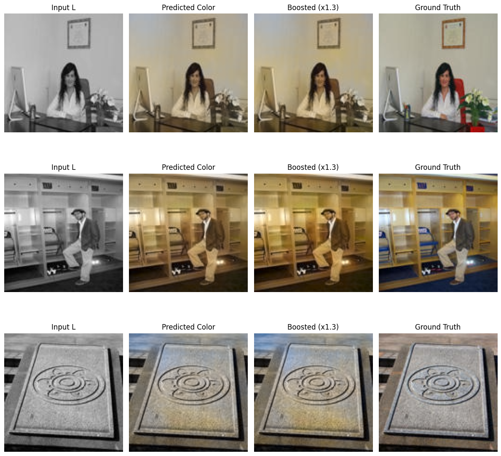

# 🎨 Image Colourization using Deep Learning

> *"Bringing black and white photos back to life with the power of AI."*

---

## 🧠 Overview

This project explores **automatic image colourization** — transforming grayscale images into realistic colour images using **deep learning**.  
By training a hybrid Convolutional Neural Network (CNN) and a Transformer to predict colour channels from luminance information.

The model is trained end-to-end on coloured image datasets, where:
- The **input** is the grayscale *L* channel from the LAB colour space.
- The **output** is the colour *a,b* channels predicted by the network.

Once trained, the model can colourize previously unseen black-and-white photographs — bringing colours to historical or artistic images.

---

## 🚀 Features

✅ Convert grayscale images to full-colour using deep learning  
✅ CNN-based encoder–decoder architecture  
✅ Automatic preprocessing pipeline (RGB → LAB → (L, ab))  
✅ Easily extendable to GAN or VGG-based perceptual models  
✅ Realistic and visually appealing colour outputs  

---

## 🧪 How It Works

1. **Preprocessing:**  
   Convert all RGB images into LAB colour space, extract the L (lightness) channel as input and the a,b (colour) channels as targets. Splitting the coloured image into a .npy array and a grayscale .jpg file

2. **Training:**  
   A hybrid CNN-Transformer based encoder–decoder model learns to predict a,b channels from the L input.

3. **Colourization:**  
   For unseen grayscale images, the model predicts the missing a,b channels and reconstructs a full-colour image.

---

## 🧰 Tech Stack

- **Python 3.10+**
- **PyTorch**
- **OpenCV** – for colour space conversion and image preprocessing
- **NumPy**, **Matplotlib**, **tqdm** – for data handling and visualization

---

## 📈 Results

| Model Results |
|---------------|
|  |

> *Colourized images generated by the model after 200 epochs of training.*

---

## 🧭 Future Improvements

- [ ] Train on a **larger dataset (Places365)**  

---

## ⚙️ Setup & Usage

```bash
# Clone the repository
git clone https://github.com/<your-username>/image-colourization.git
cd image-colourization

# Install dependencies
pip install -r requirements.txt

# Preprocess the data
python src/preprocess.py

# Train the model
python src/train.py

# Run inference
python src/inference.py --input path/to/grayscale_image.jpg
```

## 👨‍💻 Author

**Edison Chan**  
🎓 Final Year Data Science Student | Deep Learning Enthusiast  
📫 Connect with me:  
- [GitHub](https://github.com/Hiumanoid-being)   
- [LinkedIn](https://www.linkedin.com/in/edison-chan-34117a244/)  
- [Email](mailto:edison.chan404@gmail.com)


> "AI can do some pretty cool things given enough data."
